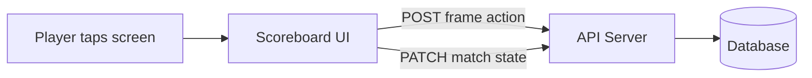
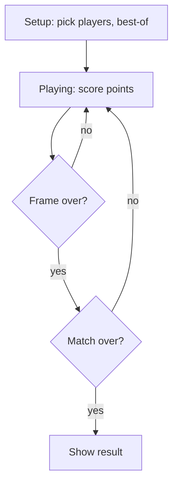

**Location:** `apps/scoreboard-ui/`
**Tech:** React 19, Vite 6, TypeScript
**Dev port:** 5173

## What it does

The scoreboard is the main interface during matches. It runs on a screen at each table. Players tap to score points, and the scoreboard sends every action to the API in real time.

## Match lifecycle

1. **Setup** — players enter names, IOC codes, and best-of frames via the setup dialog
2. **Playing** — tap the calculator to add points (pots, fouls, handicap)
3. **Frame end** — detected automatically or triggered manually via the menu
4. **Match end** — when one player reaches the required number of frames

## Components

| Component | File | Purpose |
|---|---|---|
| **App** | `App.tsx` | State machine, game logic, API calls |
| **Scoreboard** | `components/Scoreboard.tsx` | Three-column score display (player 1 / frames / player 2) |
| **SetupDialog** | `components/SetupDialog.tsx` | Player names, IOC codes, best-of selection |
| **CalculatorDialog** | `components/CalculatorDialog.tsx` | Numpad for entering points, with foul and handicap modes |
| **MenuDialog** | `components/MenuDialog.tsx` | Undo, end frame, rerack, end match early |

## Key features

- **Session persistence** — match state is saved to `sessionStorage`, so refreshing the page doesn't lose the match
- **Undo/redo** — full action history with undo support
- **Break tracking** — automatically tracks break sequences and highest breaks
- **Auto font sizing** — text scales to fit the screen via binary search (`useAutoFontSize` hook)
- **Builds to a single HTML file** — the output of `pnpm build` is a static file deployable anywhere
