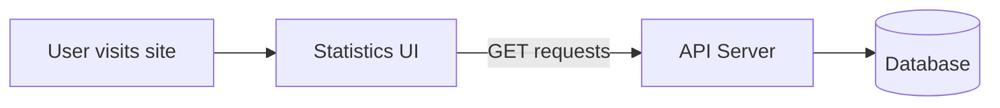

**Location:** `apps/statistics-ui/`
**Tech:** React 19, Vite 6, Chart.js, React Router
**Dev port:** 5174

## What it does

The statistics site shows everything that happens at the club — live matches, break leaderboards, player profiles, match history, and player of the month/year awards.

## Pages

| Page | Route | What it shows |
|---|---|---|
| **Live Scores** | `/` | Grid of active matches, auto-refreshes every 5 seconds |
| **Breaks** | `/breaks` | Daily breaks, historical leaderboard, break distribution matrix, Chart.js charts |
| **Player Profile** | `/player/:name` | Win/loss stats, doughnut chart, animated counters, high breaks |
| **Match History** | `/matches/:name` | Paginated table of past matches, opponent filter, frame breakdown |
| **Highlights** | `/highlights` | Player of the month/year with period navigation and 3D card flip reveal |

## Key features

- **Glassmorphism design** — frosted glass effect with dark/light theme support
- **Responsive** — works on phone, tablet, and desktop
- **Real-time updates** — live scores page polls the API every 5 seconds
- **Charts** — Chart.js integration for break distribution and player statistics
