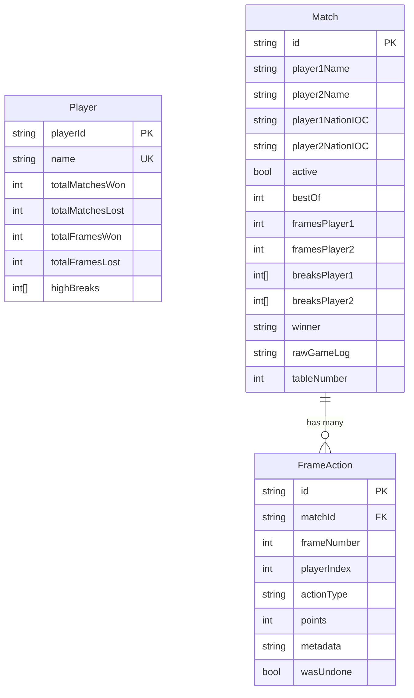
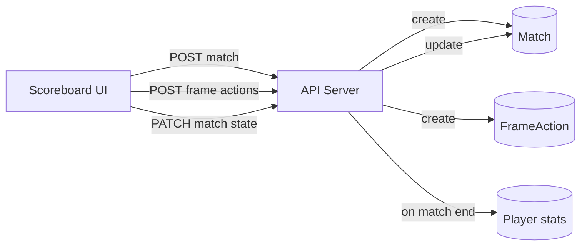

The database uses **Prisma v7** with **PostgreSQL**. The schema lives in `packages/db/prisma/schema.prisma`.

## Entity relationship diagram

## Models

### Player

Stores aggregate statistics for each player. Updated when matches complete.

| Field | Type | Description |
|---|---|---|
| `playerId` | string | Primary key (cuid) |
| `name` | string | Unique player name |
| `totalMatchesWon` | int | Lifetime matches won |
| `totalMatchesLost` | int | Lifetime matches lost |
| `totalFramesWon` | int | Lifetime frames won |
| `totalFramesLost` | int | Lifetime frames lost |
| `highBreaks` | int[] | Array of notable break values |
| `createdAt` | datetime | When the player record was created |
| `updatedAt` | datetime | Last update timestamp |

### Match

One record per match. Stores the current state (if active) or final result (if complete).

| Field | Type | Description |
|---|---|---|
| `id` | string | Primary key (cuid) |
| `player1Name` | string | Name of player 1 |
| `player2Name` | string | Name of player 2 |
| `player1NationIOC` | string | IOC country code for player 1 (e.g. "GER", "ENG") |
| `player2NationIOC` | string | IOC country code for player 2 |
| `active` | bool | `true` while the match is in progress |
| `bestOf` | int | Number of frames (e.g. 5 = first to 3) |
| `framesPlayer1` | int | Frames won by player 1 |
| `framesPlayer2` | int | Frames won by player 2 |
| `breaksPlayer1` | int[] | Array of break values scored by player 1 |
| `breaksPlayer2` | int[] | Array of break values scored by player 2 |
| `winner` | string? | Name of the winner (null while active) |
| `rawGameLog` | string | Serialised game state from the scoreboard |
| `tableNumber` | int? | Which table the match is being played on |
| `createdAt` | datetime | When the match started |
| `updatedAt` | datetime | Last state update |

### FrameAction

Granular log of every action in every frame. This is the raw event stream from the scoreboard.

| Field | Type | Description |
|---|---|---|
| `id` | string | Primary key (cuid) |
| `matchId` | string | Foreign key to Match |
| `frameNumber` | int | Which frame this action belongs to |
| `playerIndex` | int | 0 = player 1, 1 = player 2 |
| `actionType` | string | Type of action (e.g. "pot", "foul", "frame_end") |
| `points` | int | Points scored in this action |
| `metadata` | string? | Optional JSON with extra data |
| `wasUndone` | bool | Whether this action was later undone |
| `timestamp` | datetime | When the action happened |
| `createdAt` | datetime | When the record was created |

## Data flow

1. Scoreboard creates a match via `POST /api/matches`
2. During play, every pot/foul/action is sent via `POST /api/frame-actions/single`
3. Match state (scores, frames) is updated via `PATCH /api/matches`
4. When a match completes, player aggregate statistics are updated
