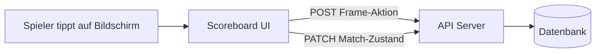
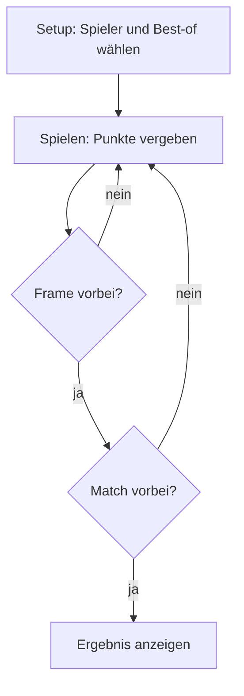

**Speicherort:** `apps/scoreboard-ui/`
**Technik:** React 19, Vite 6, TypeScript
**Dev-Port:** 5173

## Was es tut

Das Scoreboard ist die Hauptoberfläche während der Matches. Es läuft auf einem Bildschirm an jedem Tisch. Spieler tippen, um Punkte zu vergeben, und das Scoreboard sendet jede Aktion in Echtzeit an das API.

## Match-Ablauf

1. **Setup** — Spieler geben Namen, IOC-Codes und Best-of-Frames im Setup-Dialog ein
2. **Spielen** — auf den Taschenrechner tippen, um Punkte hinzuzufügen (Pots, Fouls, Handicap)
3. **Frame-Ende** — wird automatisch erkannt oder manuell über das Menü ausgelöst
4. **Match-Ende** — wenn ein Spieler die erforderliche Anzahl an Frames erreicht

## Komponenten

| Komponente | Datei | Zweck |
|---|---|---|
| **App** | `App.tsx` | State Machine, Spiellogik, API-Aufrufe |
| **Scoreboard** | `components/Scoreboard.tsx` | Drei-Spalten-Anzeige (Spieler 1 / Frames / Spieler 2) |
| **SetupDialog** | `components/SetupDialog.tsx` | Spielernamen, IOC-Codes, Best-of-Auswahl |
| **CalculatorDialog** | `components/CalculatorDialog.tsx` | Ziffernblock für Punkteingabe, mit Foul- und Handicap-Modus |
| **MenuDialog** | `components/MenuDialog.tsx` | Rückgängig, Frame beenden, Rerack, Match vorzeitig beenden |

## Hauptfunktionen

- **Session-Persistenz** — Match-Zustand wird in `sessionStorage` gespeichert, sodass Seite-Neuladen das Match nicht verliert
- **Rückgängig/Wiederholen** — vollständige Aktionshistorie mit Rückgängig-Unterstützung
- **Break-Tracking** — verfolgt automatisch Break-Sequenzen und höchste Breaks
- **Auto-Schriftgröße** — Text skaliert sich per Binärsuche an den Bildschirm (`useAutoFontSize` Hook)
- **Baut zu einer einzelnen HTML-Datei** — die Ausgabe von `pnpm build` ist eine statische Datei, überall einsetzbar
