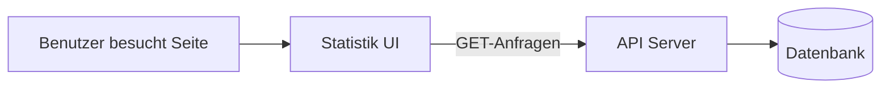

**Speicherort:** `apps/statistics-ui/`
**Technik:** React 19, Vite 6, Chart.js, React Router
**Dev-Port:** 5174

## Was es tut

Die Statistik-Seite zeigt alles, was im Club passiert — Live-Matches, Break-Ranglisten, Spielerprofile, Match-Historie und Spieler des Monats/Jahres.

## Seiten

| Seite | Route | Was angezeigt wird |
|---|---|---|
| **Live-Ergebnisse** | `/` | Raster aktiver Matches, aktualisiert sich alle 5 Sekunden |
| **Breaks** | `/breaks` | Tägliche Breaks, historische Rangliste, Break-Verteilungsmatrix, Chart.js-Diagramme |
| **Spielerprofil** | `/player/:name` | Sieg/Niederlage-Statistiken, Doughnut-Diagramm, animierte Zähler, High Breaks |
| **Match-Historie** | `/matches/:name` | Paginierte Tabelle vergangener Matches, Gegnerfilter, Frame-Aufschlüsselung |
| **Highlights** | `/highlights` | Spieler des Monats/Jahres mit Periodennavigation und 3D-Karten-Flip-Enthüllung |

## Hauptfunktionen

- **Glasmorphismus-Design** — Milchglas-Effekt mit Dunkel-/Hell-Theme-Unterstützung
- **Responsive** — funktioniert auf Handy, Tablet und Desktop
- **Echtzeit-Updates** — Live-Ergebnisse-Seite fragt das API alle 5 Sekunden ab
- **Diagramme** — Chart.js-Integration für Break-Verteilung und Spielerstatistiken
