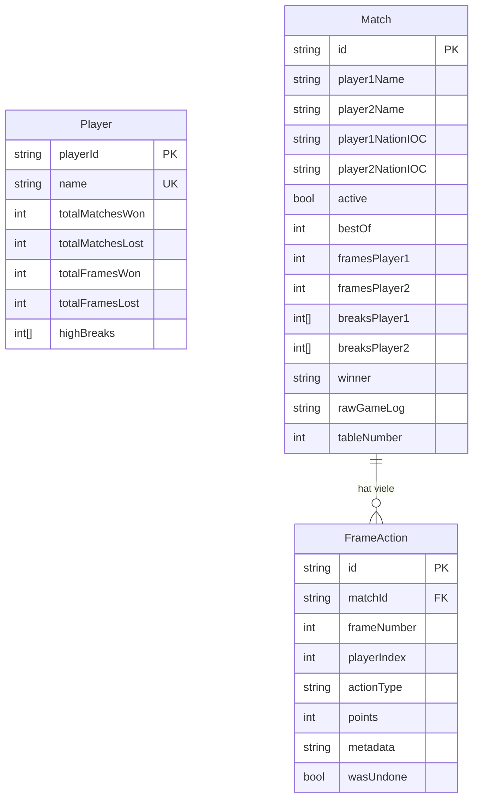
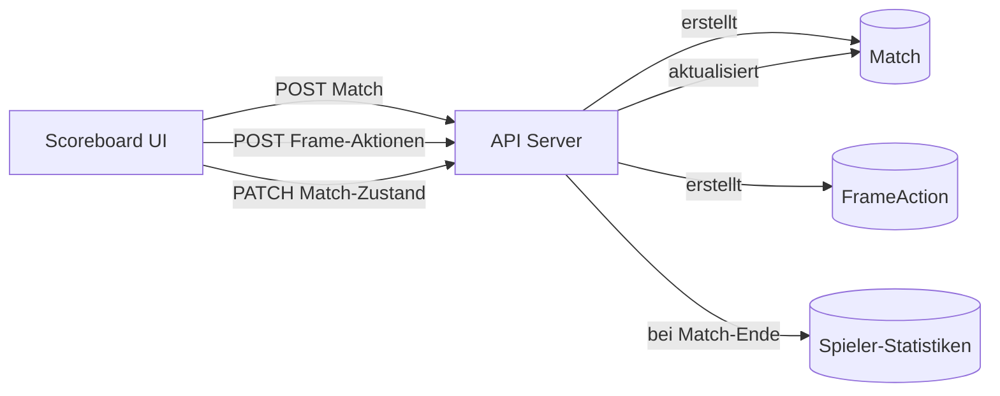

Die Datenbank verwendet **Prisma v7** mit **PostgreSQL**. Das Schema liegt in `packages/db/prisma/schema.prisma`.

## Entity-Relationship-Diagramm

## Modelle

### Player (Spieler)

Speichert aggregierte Statistiken für jeden Spieler. Wird aktualisiert, wenn Matches beendet werden.

| Feld | Typ | Beschreibung |
|---|---|---|
| `playerId` | string | Primärschlüssel (cuid) |
| `name` | string | Eindeutiger Spielername |
| `totalMatchesWon` | int | Gewonnene Matches insgesamt |
| `totalMatchesLost` | int | Verlorene Matches insgesamt |
| `totalFramesWon` | int | Gewonnene Frames insgesamt |
| `totalFramesLost` | int | Verlorene Frames insgesamt |
| `highBreaks` | int[] | Array von bemerkenswerten Break-Werten |
| `createdAt` | datetime | Wann der Spielerdatensatz erstellt wurde |
| `updatedAt` | datetime | Letzter Aktualisierungszeitpunkt |

### Match

Ein Datensatz pro Match. Speichert den aktuellen Zustand (wenn aktiv) oder das Endergebnis (wenn abgeschlossen).

| Feld | Typ | Beschreibung |
|---|---|---|
| `id` | string | Primärschlüssel (cuid) |
| `player1Name` | string | Name von Spieler 1 |
| `player2Name` | string | Name von Spieler 2 |
| `player1NationIOC` | string | IOC-Ländercode für Spieler 1 (z.B. "GER", "ENG") |
| `player2NationIOC` | string | IOC-Ländercode für Spieler 2 |
| `active` | bool | `true` während das Match läuft |
| `bestOf` | int | Anzahl der Frames (z.B. 5 = Best of 5, erster bis 3) |
| `framesPlayer1` | int | Gewonnene Frames von Spieler 1 |
| `framesPlayer2` | int | Gewonnene Frames von Spieler 2 |
| `breaksPlayer1` | int[] | Array der Break-Werte von Spieler 1 |
| `breaksPlayer2` | int[] | Array der Break-Werte von Spieler 2 |
| `winner` | string? | Name des Gewinners (null während das Match läuft) |
| `rawGameLog` | string | Serialisierter Spielzustand vom Scoreboard |
| `tableNumber` | int? | An welchem Tisch das Match gespielt wird |
| `createdAt` | datetime | Wann das Match begonnen hat |
| `updatedAt` | datetime | Letzte Zustandsaktualisierung |

### FrameAction (Frame-Aktion)

Detailliertes Protokoll jeder Aktion in jedem Frame. Das ist der rohe Eventstrom vom Scoreboard.

| Feld | Typ | Beschreibung |
|---|---|---|
| `id` | string | Primärschlüssel (cuid) |
| `matchId` | string | Fremdschlüssel zu Match |
| `frameNumber` | int | Zu welchem Frame diese Aktion gehört |
| `playerIndex` | int | 0 = Spieler 1, 1 = Spieler 2 |
| `actionType` | string | Art der Aktion (z.B. "pot", "foul", "frame_end") |
| `points` | int | Erzielte Punkte |
| `metadata` | string? | Optionaler JSON-String mit Zusatzdaten |
| `wasUndone` | bool | Ob diese Aktion rückgängig gemacht wurde |
| `timestamp` | datetime | Wann die Aktion passiert ist |
| `createdAt` | datetime | Wann der Datensatz erstellt wurde |

## Datenfluss

1. Scoreboard erstellt ein Match via `POST /api/matches`
2. Während des Spiels wird jeder Pot/Foul/Aktion via `POST /api/frame-actions/single` gesendet
3. Match-Zustand (Punkte, Frames) wird via `PATCH /api/matches` aktualisiert
4. Wenn ein Match endet, werden die aggregierten Spielerstatistiken aktualisiert
