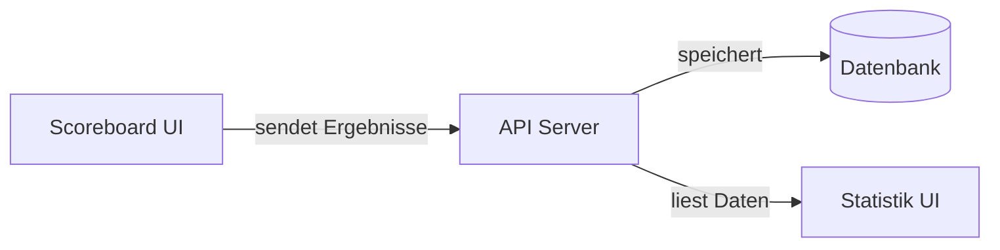
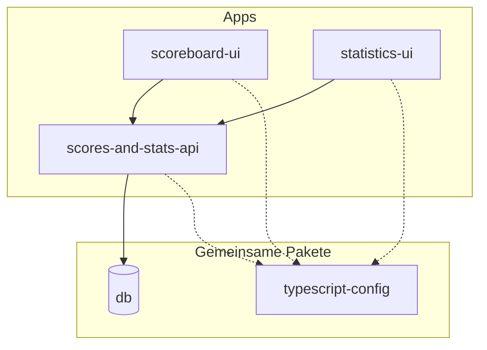

import { Tabs, TabItem } from '@astrojs/starlight/components';

Hey Markus,

Diese Dokumentationsseite ist für uns beide — damit wir verstehen, wie alle RRSB-Clubsysteme funktionieren, wie sie zusammenhängen und wie man daran arbeiten kann.

Die Seite wird noch aufgebaut. Du kannst aber jetzt schon in der linken Navigation sehen, wie alles organisiert sein wird. Die Seiten sind ausgegraut, weil sie noch keinen Inhalt haben, aber sie zeigen dir die grobe Struktur von dem, was kommt — Datenbank-Doku, API-Referenz, App-Anleitungen und Betriebsthemen wie zum Beispiel, wie man alles lokal startet.

## Was machen wir hier?

Wir haben vier Ziele:

<Tabs>
  <TabItem label="1. Ein Ort">
    Das Scoreboard, die Statistik-Website, das Backend-API und die Datenbank waren alles separate Projekte in separaten Repositories. Das hat es schwer gemacht, den Überblick zu behalten, und Änderungen an einer Stelle konnten etwas anderes kaputtmachen, ohne dass wir es bemerkt haben.

    Jetzt lebt alles in einem einzigen **Monorepo** — einem GitHub-Repository, das alle Apps und den gemeinsam genutzten Code enthält. Stell es dir vor wie einen Werkzeugkasten, in dem alle Werkzeuge zusammen sind, statt in verschiedenen Schubladen verstreut zu liegen.
  </TabItem>
  <TabItem label="2. Qualität">
    Der alte Code wurde über 15 Jahre hinweg schnell geschrieben, ohne viel aufzuräumen. Manches war unsicher, manches schwer zu lesen, und manches einfach nur chaotisch. Wir schreiben jedes Teil mit modernem, sauberem, gut strukturiertem Code neu.

    Ein großer Teil davon ist die Verwendung **eines einheitlichen Tech Stacks**. Das alte System war auf drei verschiedene Sprachen und Frameworks verteilt — PHP für die Website, eine Mischung aus rohem JavaScript für das Scoreboard und ein separates Backend-Setup. Das bedeutete, drei verschiedene Welten zu lernen und zu pflegen. Jetzt ist alles TypeScript und React. Eine Sprache, ein Satz von Mustern. Das macht das gesamte System einfacher zu warten, und es bedeutet, dass du nur einen Stack lernen musst statt drei.

    Wir fügen auch **Dokumentation direkt im Code** hinzu — klare Funktionsnamen, Typ-Annotationen die erklären wie die Daten aussehen, und Inline-Kommentare wo die Logik nicht offensichtlich ist. Die Code-Dokumentation und diese Seite verweisen aufeinander: wenn du hier über ein Feature liest, findest du Verweise auf die tatsächlichen Quelldateien, und wenn du den Code liest, verweisen Kommentare auf die entsprechende Doku-Seite.
  </TabItem>
  <TabItem label="3. Verständlich">
    Code sollte lesbar sein. Wenn man eine Datei öffnet, sollte klar sein, was sie tut. Wir dokumentieren alles — sowohl im Code selbst als auch hier auf dieser Seite.
  </TabItem>
  <TabItem label="4. Diese Seite">
    Du liest sie gerade. Sie existiert auf Deutsch und Englisch (Umschalten mit dem Sprach-Toggle oben in der Leiste). Das Ziel ist, dass du das gesamte System verstehen, fundierte Fragen stellen und dich mit der Zeit mit JavaScript/TypeScript vertraut machen kannst, wenn du möchtest.
  </TabItem>
</Tabs>

Hier ist der Plan und wo wir stehen:

```mermaid
block-beta
    columns 7
    L1["Index →"] I1["1"] I2["2"] I3["3"] I4["4"] I5["5"] I6["6"]
    L2["Schritt →"] A["Monorepo<br/>Setup"] B["Alte Apps ins<br/>Monorepo kopieren"] C["Neues Scoreboard UI<br/>mit sauberem Code"] D["Neues Datenmodell<br/>+ API-Unterstützung"] E["Neues Admin UI<br/>+ Scoreboard-Unterstützung"] F["..."]
    L3["Status →"] S1["✅ Abgeschlossen"] S2["✅ Abgeschlossen"] S3["✅ Abgeschlossen"] S4["Implementiert &<br/>wird getestet"] S5["Implementiert &<br/>wird getestet"] space

    style L1 fill:transparent,stroke:none,color:#9ca3af
    style L2 fill:transparent,stroke:none,color:#9ca3af
    style L3 fill:transparent,stroke:none,color:#9ca3af
    style I1 fill:transparent,stroke:none,color:#d1d5db
    style I2 fill:transparent,stroke:none,color:#d1d5db
    style I3 fill:transparent,stroke:none,color:#d1d5db
    style I4 fill:transparent,stroke:none,color:#d1d5db
    style I5 fill:transparent,stroke:none,color:#d1d5db
    style I6 fill:transparent,stroke:none,color:#d1d5db
    style A fill:#16a34a,color:#fff,stroke:#15803d,font-size:16px
    style B fill:#16a34a,color:#fff,stroke:#15803d,font-size:16px
    style C fill:#16a34a,color:#fff,stroke:#15803d,font-size:16px
    style D fill:#2563eb,color:#fff,stroke:#1d4ed8,font-size:16px
    style E fill:#6b7280,color:#fff,stroke:#4b5563,font-size:16px
    style F fill:#6b7280,color:#fff,stroke:#4b5563,font-size:16px
    style S1 fill:transparent,stroke:none,color:#9ca3af
    style S2 fill:transparent,stroke:none,color:#9ca3af
    style S3 fill:transparent,stroke:none,color:#9ca3af
    style S4 fill:transparent,stroke:none,color:#9ca3af
    style S5 fill:transparent,stroke:none,color:#9ca3af
```

## Die Apps

| App | Was sie tut |
|---|---|
| **scoreboard-ui** | Das Scoreboard, das man auf den Bildschirmen während der Matches sieht. Spieler tippen, um Punkte zu vergeben. |
| **scores-and-stats-api** | Der Backend-Server. Empfängt Ergebnisse vom Scoreboard, speichert sie in der Datenbank und liefert Daten an die Statistik-Seite. |
| **statistics-ui** | Die Statistik-Website. Breaks, Ranglisten, Spielerprofile, Live-Ergebnisse, Highlights. |
| **db** | Die gemeinsame Datenbank. Speichert Spieler, Matches, Frame-Aktionen und alles andere. |

## Wie sie zusammenhängen

Wenn jemand ein Match auf dem Scoreboard spielt, wird jede Aktion (Pot, Foul, Frame-Ende) an das API geschickt, das sie in der Datenbank speichert. Die Statistik-Seite liest aus derselben Datenbank, um Breaks, Ranglisten und Live-Ergebnisse anzuzeigen.

## Die Monorepo-Struktur

Ein **Monorepo** (kurz für "monolithisches Repository") ist ein einzelnes Git-Repository, das mehrere Projekte zusammen enthält. Statt dass jede App ein eigenes Repo mit eigenem Setup, eigenen Abhängigkeiten und eigenem Deploy-Prozess hat, lebt alles nebeneinander. Gemeinsamer Code (wie der Datenbank-Client oder die TypeScript-Konfiguration) wird einmal geschrieben und von allen Apps genutzt. Tools wie [pnpm Workspaces](https://pnpm.io/workspaces) und [Turborepo](https://turbo.build/repo) sorgen dafür, dass das reibungslos funktioniert.

Unser Monorepo: [github.com/dennisfurrer/rrsb-mono](https://github.com/dennisfurrer/rrsb-mono/tree/main)

