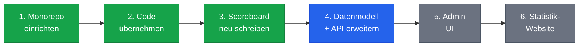

## Übersicht

## Der Plan

### 1. Monorepo einrichten ✅

Ein einzelnes Repository erstellen, das alle Apps und den gemeinsamen Code enthält. Wir haben jetzt ein GitHub-Repo für alles — kein Springen mehr zwischen `scoreboard/`, `scoreboard-be/` und `rrsb-breaks-calendar/`.

**Status: Erledigt**

### 2. Bestehenden Code übernehmen und bestätigen, dass er funktioniert ✅

Das bestehende Datenbankschema, das API, das Scoreboard und die Statistik-Seite in die neue Repo-Struktur bringen. Sicherstellen, dass alles noch funktioniert, bevor wir anfangen, Dinge zu ändern.

**Status: Erledigt**

### 3. Scoreboard-UI neu schreiben ✅

Das alte Scoreboard war mit jQuery, PHP und Vanilla-JavaScript gebaut — schwer zu lesen und noch schwerer zu ändern. Wir haben es mit React (einem modernen UI-Framework) und Vite als Build-Tool neu geschrieben.

Das Ergebnis ist das gleiche: eine einzelne HTML-Datei, die überall hochgeladen werden kann und auf jedem Bildschirm funktioniert. Aber der Code dahinter ist jetzt sauber, gut strukturiert und einfach zu warten.

**Status: Erledigt**

---

### 4. Datenmodell + Backend-API erweitern

Das aktuelle Datenbankschema ist minimal — es wurde für das ursprüngliche Scoreboard gebaut und sonst nichts. Wir müssen es erweitern, um folgendes zu unterstützen:

- Admin-UI-Funktionen (Turnierverwaltung, Tischzuweisungen)
- Welchem Club ein Tisch gehört
- Spieler-Namenslisten und -Verwaltung
- Und alles andere, was wir besprochen haben

Das API wird gleichzeitig aktualisiert, um das neue Datenmodell zu verwenden. Alle bestehenden Daten bleiben erhalten — wir migrieren sicher und löschen nie.

**Status: Als Nächstes**

### 5. Admin-UI erstellen

Eine neue App zur Verwaltung von Dingen, die derzeit manuelle Datenbankänderungen erfordern:

- Turniereinrichtung und -verwaltung
- Spielerverwaltung
- Tischzuweisungen
- Match-Konfiguration

**Status: Geplant**

### 6. Statistik-Website neu schreiben

Gleicher Ansatz wie beim Scoreboard — die bestehende 6.555-Zeilen-Einzeldatei-Statistikseite nehmen und als saubere, moderne React-App neu aufbauen.

**Status: Geplant**
