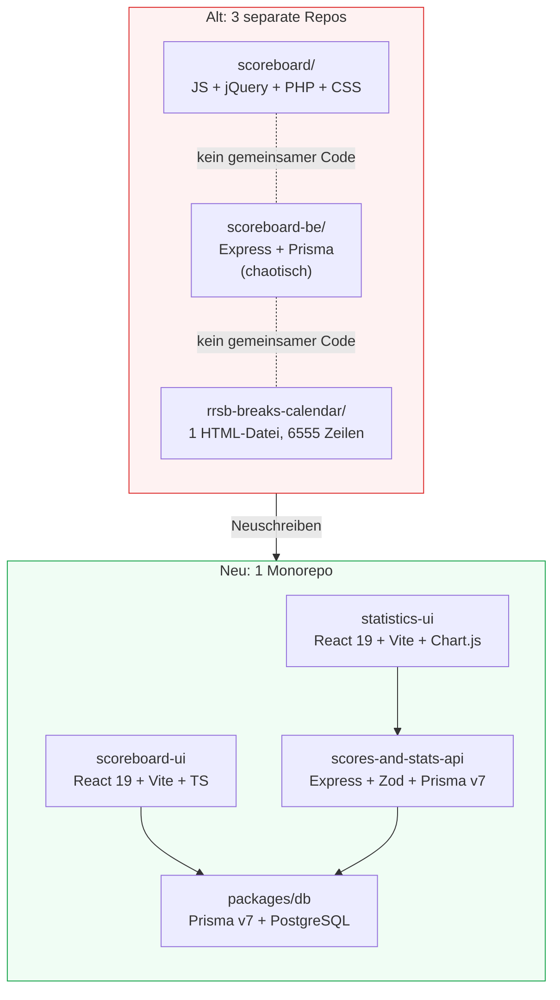

## Architekturvergleich

## Das alte Setup

Jedes System wurde über die Jahre hinweg unabhängig mit dem gebaut, was gerade verfügbar war.

### Statistik-Website (rrsb-breaks-calendar)

| | |
|---|---|
| **Was** | Breaks-Kalender, Ranglisten, Spielerprofile, Live-Ergebnisse, Highlights |
| **Technik** | HTML, CSS, Vanilla-JavaScript mit CSS-Transform-Animationen |
| **Struktur** | Alles in **einer einzigen Datei** — 6.555 Zeilen Code |
| **Probleme** | Unmöglich zu warten, keine Trennung der Zuständigkeiten, kein Build-Schritt, extrem fragil |

### Stats-Backend (scoreboard-be)

| | |
|---|---|
| **Was** | API, das Match-Daten speichert und bereitstellt |
| **Technik** | Express.js, TypeScript, Prisma |
| **Probleme** | Schlecht strukturierter Code, viel toter/ungenutzter Code, unsichere Datenbankabfragen, veraltete Routen gemischt mit aktiven |

### Scoreboard-UI (scoreboard)

| | |
|---|---|
| **Was** | Das Match-Scoreboard, das auf Bildschirmen im Club angezeigt wird |
| **Technik** | Vanilla-JavaScript, HTML, jQuery, PHP, CSS |
| **Probleme** | Schreckliche Codequalität, schwer zu verstehen, schwer zu ändern, PHP-Abhängigkeit ohne guten Grund |

---

## Das neue Setup

Alles lebt in einem Monorepo mit gemeinsamen Tools.

### Gemeinsame Grundlage

| Tool | Zweck |
|---|---|
| **Turborepo** | Führt Builds/Tasks über alle Apps hinweg effizient aus |
| **pnpm** | Paketmanager (wie npm, aber schneller und verbraucht weniger Speicherplatz) |
| **TypeScript** | Typsicheres JavaScript — findet Fehler, bevor der Code ausgeführt wird |
| **Prisma v7** | Datenbank-Toolkit — definiert das Datenmodell, generiert typsichere Abfragen |
| **PostgreSQL** | Die Datenbank-Engine, die alles speichert |

### Scoreboard-UI → `apps/scoreboard-ui` ✅

| | |
|---|---|
| **Technik** | React 19, Vite 6, TypeScript |
| **Struktur** | Saubere Komponentenarchitektur — Scoreboard, SetupDialog, CalculatorDialog, MenuDialog |
| **Ausgabe** | Wird immer noch zu einer einzelnen HTML-Datei gebaut, überall einsetzbar |
| **Verbesserung** | Lesbar, wartbar, typsicher. Einfach neue Features hinzuzufügen |

### Stats-Backend → `apps/scores-and-stats-api`

| | |
|---|---|
| **Technik** | Express.js, TypeScript, Zod-Validierung, Prisma v7 |
| **Struktur** | Routen-Module (Matches, Spieler, Breaks, Highlights, Frame-Aktionen, Match-Verlauf) |
| **Verbesserung** | Eingabevalidierung, sichere Datenbankabfragen, kein toter Code, saubere Trennung |

### Statistik-Website → `apps/statistics-ui`

| | |
|---|---|
| **Technik** | React 19, Vite 6, Chart.js, React Router |
| **Struktur** | Seiten (Breaks, Live-Ergebnisse, Spielerprofil, Match-Verlauf, Highlights) mit gemeinsamem Layout |
| **Verbesserung** | Von 6.555 Zeilen in einer Datei zu sauberen, getrennten Komponenten |

### Datenbank → `packages/db`

| | |
|---|---|
| **Technik** | Prisma v7 mit PostgreSQL-Adapter |
| **Was sich geändert hat** | In ein gemeinsames Paket extrahiert, damit alle Apps denselben Datenbank-Client und dasselbe Schema verwenden |
