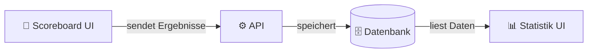
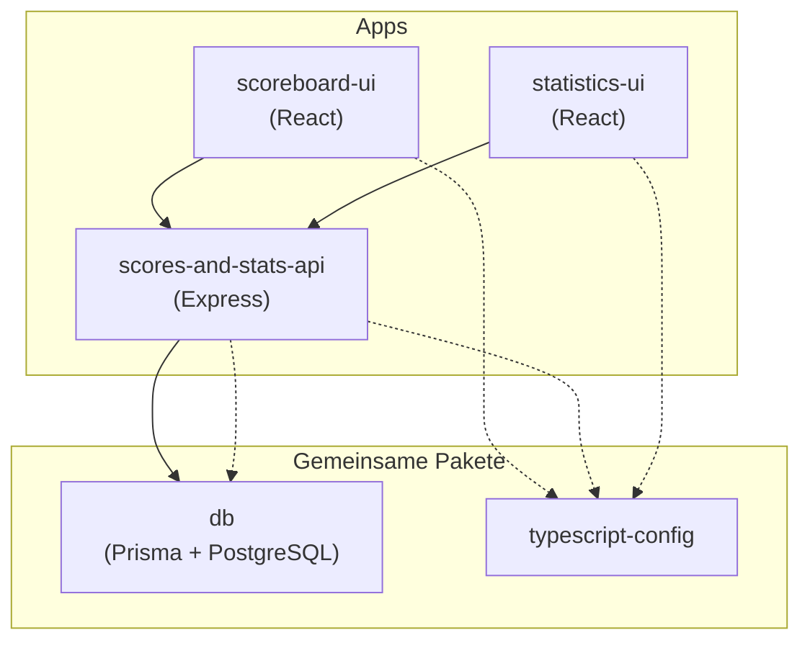

Hey Markus,

Diese Dokumentationsseite ist für uns beide — damit wir verstehen, wie alle RRSB-Clubsysteme funktionieren, wie sie zusammenhängen und wie man daran arbeiten kann.

## Was machen wir hier?

Wir haben vier Ziele:

### 1. Alles an einem Ort zusammenführen

Das Scoreboard, die Statistik-Website, das Backend-API und die Datenbank waren alles separate Projekte in separaten Repositories. Das hat es schwer gemacht, den Überblick zu behalten, und Änderungen an einer Stelle konnten etwas anderes kaputtmachen, ohne dass wir es bemerkt haben.

Jetzt lebt alles in einem einzigen **Monorepo** — einem GitHub-Repository, das alle Apps und den gemeinsam genutzten Code enthält. Stell es dir vor wie einen Werkzeugkasten, in dem alle Werkzeuge zusammen sind, statt in verschiedenen Schubladen verstreut zu liegen.

### 2. Die Qualität von allem verbessern

Der alte Code wurde über 15 Jahre hinweg schnell geschrieben, ohne viel aufzuräumen. Manches war unsicher, manches schwer zu lesen, und manches einfach nur chaotisch. Wir schreiben jedes Teil mit modernem, sauberem, gut strukturiertem Code neu.

### 3. Verständlich machen

Code sollte lesbar sein. Wenn man eine Datei öffnet, sollte klar sein, was sie tut. Wir dokumentieren alles — sowohl im Code selbst als auch hier auf dieser Seite.

### 4. Diese Dokumentationsseite

Du liest sie gerade. Sie existiert auf Deutsch und Englisch (Umschalten mit dem Sprach-Toggle oben in der Leiste). Das Ziel ist, dass du das gesamte System verstehen, fundierte Fragen stellen und dich mit der Zeit mit JavaScript/TypeScript vertraut machen kannst, wenn du möchtest.

## Die Apps

| App | Was sie tut |
|---|---|
| **scoreboard-ui** | Das Scoreboard, das man auf den Bildschirmen während der Matches sieht. Spieler tippen, um Punkte zu vergeben. |
| **scores-and-stats-api** | Der Backend-Server. Empfängt Ergebnisse vom Scoreboard, speichert sie in der Datenbank und liefert Daten an die Statistik-Seite. |
| **statistics-ui** | Die Statistik-Website. Breaks, Ranglisten, Spielerprofile, Live-Ergebnisse, Highlights. |
| **db** | Die gemeinsame Datenbank. Speichert Spieler, Matches, Frame-Aktionen und alles andere. |

## Wie sie zusammenhängen

Wenn jemand ein Match auf dem Scoreboard spielt, wird jede Aktion (Pot, Foul, Frame-Ende) an das API geschickt, das sie in der Datenbank speichert. Die Statistik-Seite liest aus derselben Datenbank, um Breaks, Ranglisten und Live-Ergebnisse anzuzeigen.

## Die Monorepo-Struktur

