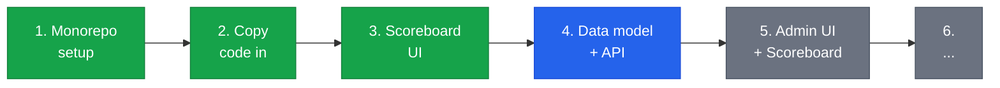
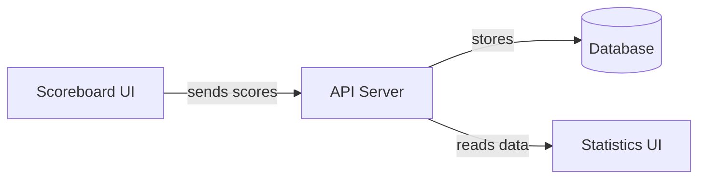
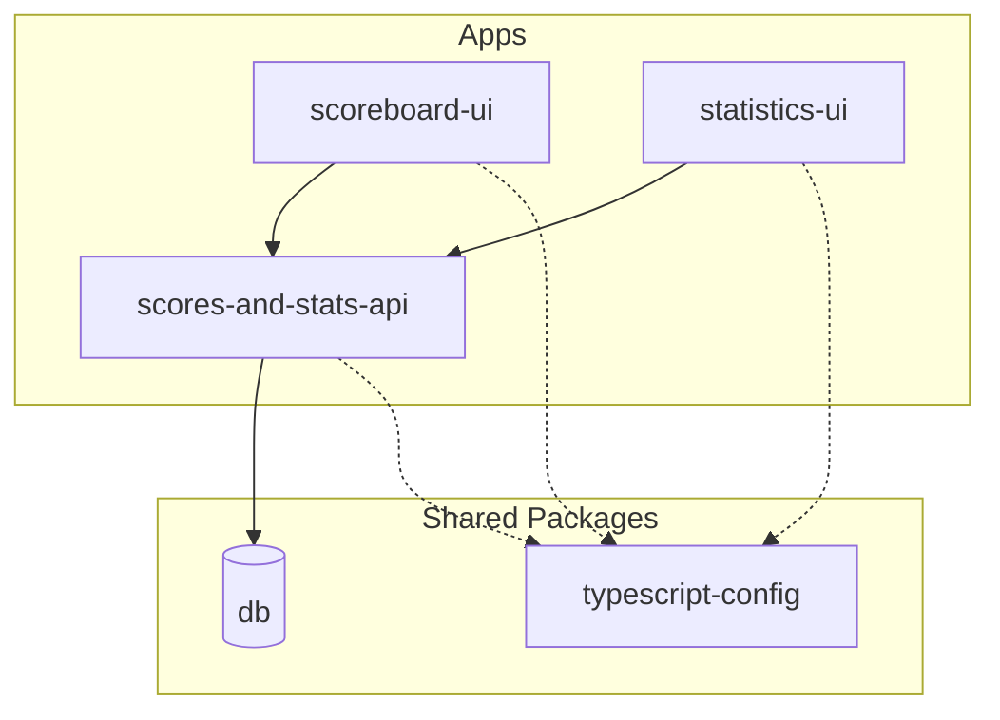

import { Tabs, TabItem } from '@astrojs/starlight/components';

Hey Markus,

This documentation site is for both of us — to understand how all the RRSB club systems work, how they fit together, and how to work on them.

The site is still being built out. For now, you can see how everything will be organized by looking at the sections in the left navigation. The pages are greyed out because they don't have content yet, but they show you the rough structure of what's coming — database docs, API reference, app guides, and operational stuff like how to run everything locally.

## What are we doing here?

We have four goals:

<Tabs>
  <TabItem label="1. One place">
    The scoreboard, the statistics website, the backend API, and the database were all separate projects in separate repositories. That made it hard to keep track of what's where, and changes in one place could break another without us noticing.

    Now everything lives in a single **monorepo** — one GitHub repository that contains all the apps and shared code. Think of it like putting all your tools in one toolbox instead of having them scattered across different drawers.
  </TabItem>
  <TabItem label="2. Quality">
    The old code was written quickly over 15 years without much cleanup along the way. Some of it was unsafe, some was hard to read, and some was just messy. We're rewriting each piece with modern, clean, well-structured code.

    A big part of this is using **one consistent tech stack** across the board. The old system was split across three different languages and frameworks — PHP for the website, a mix of raw JavaScript for the scoreboard, and a separate backend setup. That meant learning and maintaining three different worlds. Now everything is TypeScript and React. One language, one set of patterns. That makes the whole system easier to maintain, and it means you only need to learn one stack instead of three.

    We're also adding **documentation directly in the code** — clear function names, type annotations that explain what data looks like, and inline comments where the logic isn't obvious. The code docs and this site link to each other: when you read about a feature here, you'll find references to the actual source files, and when you read the code, comments will point back to the relevant docs page.
  </TabItem>
  <TabItem label="3. Understandable">
    Code should be readable. When you open a file, it should be clear what it does. We're documenting everything — both in the code itself and here on this site.
  </TabItem>
  <TabItem label="4. This site">
    You're reading it. It exists in both English and German (switch with the language toggle in the top bar). The goal is that you can understand the entire system, ask informed questions, and over time get comfortable with JavaScript/TypeScript if you want to.
  </TabItem>
</Tabs>

Here's the plan and where we are:

## The apps

| App | What it does |
|---|---|
| **scoreboard-ui** | The scoreboard you see on the screens during matches. Players tap to score points. |
| **scores-and-stats-api** | The backend server. It receives scores from the scoreboard, stores them in the database, and serves data to the statistics site. |
| **statistics-ui** | The statistics website. Breaks, leaderboards, player profiles, live scores, highlights. |
| **db** | The shared database. Stores players, matches, frame actions, and everything else. |

## How they connect

When someone plays a match on the scoreboard, every action (pot, foul, frame end) gets sent to the API, which saves it to the database. The statistics site reads from the same database to show breaks, leaderboards, and live scores.

## The monorepo structure

A **monorepo** (short for "monolithic repository") is a single Git repository that holds multiple projects together. Instead of each app having its own repo with its own setup, dependencies, and deploy process, everything lives side by side. Shared code (like the database client or TypeScript config) is written once and used by all apps. Tools like [pnpm workspaces](https://pnpm.io/workspaces) and [Turborepo](https://turbo.build/repo) make this work smoothly.

Our monorepo: [github.com/dennisfurrer/rrsb-mono](https://github.com/dennisfurrer/rrsb-mono/tree/main)

