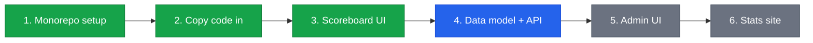

## Overview

## The plan

### 1. Set up the monorepo ✅

Create a single repository that contains all apps and shared code. We now have one GitHub repo for everything — no more jumping between `scoreboard/`, `scoreboard-be/`, and `rrsb-breaks-calendar/`.

**Status: Done**

### 2. Copy existing code in and confirm it works ✅

Bring the existing database schema, API, scoreboard, and statistics site into the new repo structure. Make sure everything still works before we start changing things.

**Status: Done**

### 3. Rewrite the scoreboard UI ✅

The old scoreboard was built with jQuery, PHP, and vanilla JavaScript — hard to read and harder to change. We rewrote it using React (a modern UI framework) with Vite as the build tool.

The end result is the same: a single HTML file that can be uploaded anywhere and works on any screen. But the code behind it is now clean, well-structured, and easy to maintain.

**Status: Done**

---

### 4. Upgrade the data model + backend API

The current database schema is minimal — it was built for the original scoreboard and nothing else. We need to extend it to support:

- Admin UI features (tournament management, table assignments)
- Which club a table belongs to
- Player name lists and management
- And everything else we've discussed

The API gets upgraded at the same time to use the new data model. All existing data will be retained — we migrate safely, never delete.

**Status: Up next**

### 5. Create an admin UI

A new app for managing things that currently require manual database edits:

- Tournament setup and management
- Player management
- Table assignments
- Match configuration

**Status: Planned**

### 6. Rewrite the statistics website

Same approach as the scoreboard — take the existing 6,555-line single-file statistics site and rebuild it as a clean, modern React app.

**Status: Planned**
