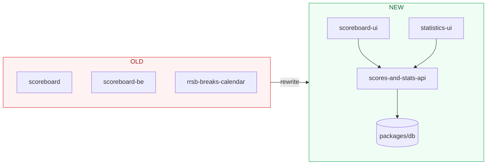

## Architecture comparison

## The old setup

Each system was built independently over the years with whatever was available at the time.

### Statistics website (rrsb-breaks-calendar)

| | |
|---|---|
| **What** | Breaks calendar, leaderboards, player profiles, live scores, highlights |
| **Tech** | HTML, CSS, vanilla JavaScript with CSS transform animations |
| **Structure** | Everything in **one single file** — 6,555 lines of code |
| **Problems** | Impossible to maintain, no separation of concerns, no build step, extremely fragile |

### Stats backend (scoreboard-be)

| | |
|---|---|
| **What** | API that stores and serves match data |
| **Tech** | Express.js, TypeScript, Prisma |
| **Problems** | Poorly structured code, lots of dead/unused code, unsafe database queries, deprecated routes mixed with active ones |

### Scoreboard UI (scoreboard)

| | |
|---|---|
| **What** | The match scoreboard displayed on screens at the club |
| **Tech** | Vanilla JavaScript, HTML, jQuery, PHP, CSS |
| **Problems** | Terrible code quality, hard to understand, hard to change, PHP dependency for no good reason |

---

## The new setup

Everything lives in one monorepo with shared tooling.

### Shared foundation

| Tool | Purpose |
|---|---|
| **Turborepo** | Runs builds/tasks across all apps efficiently |
| **pnpm** | Package manager (like npm, but faster and uses less disk space) |
| **TypeScript** | Type-safe JavaScript — catches errors before code runs |
| **Prisma v7** | Database toolkit — defines the data model, generates type-safe queries |
| **PostgreSQL** | The database engine that stores everything |

### Scoreboard UI → `apps/scoreboard-ui` ✅

| | |
|---|---|
| **Tech** | React 19, Vite 6, TypeScript |
| **Structure** | Clean component architecture — Scoreboard, SetupDialog, CalculatorDialog, MenuDialog |
| **Output** | Still builds to a single HTML file, deployable anywhere |
| **Improvement** | Readable, maintainable, type-safe. Easy to add features |

### Stats backend → `apps/scores-and-stats-api`

| | |
|---|---|
| **Tech** | Express.js, TypeScript, Zod validation, Prisma v7 |
| **Structure** | Route modules (matches, players, breaks, highlights, frame-actions, match-history) |
| **Improvement** | Input validation, safe database queries, no dead code, clean separation |

### Statistics website → `apps/statistics-ui`

| | |
|---|---|
| **Tech** | React 19, Vite 6, Chart.js, React Router |
| **Structure** | Pages (Breaks, Live Scores, Player Profile, Match History, Highlights) with shared layout |
| **Improvement** | From 6,555 lines in one file to clean, separated components |

### Database → `packages/db`

| | |
|---|---|
| **Tech** | Prisma v7 with PostgreSQL adapter |
| **What changed** | Extracted into a shared package so all apps use the same database client and schema |
