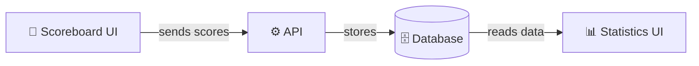
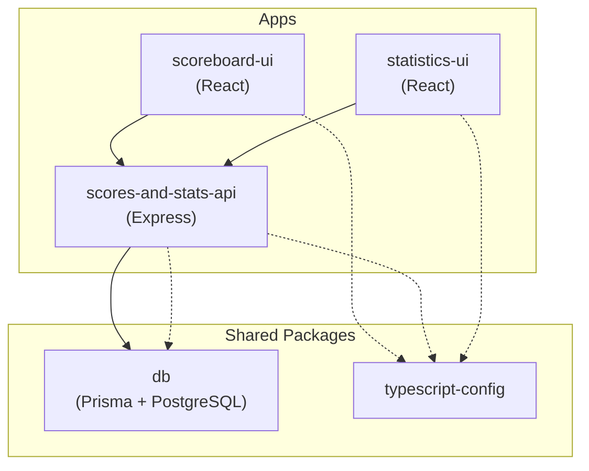

Hey Markus,

This documentation site is for both of us — to understand how all the RRSB club systems work, how they fit together, and how to work on them.

## What are we doing here?

We have four goals:

### 1. Put everything in one place

The scoreboard, the statistics website, the backend API, and the database were all separate projects in separate repositories. That made it hard to keep track of what's where, and changes in one place could break another without us noticing.

Now everything lives in a single **monorepo** — one GitHub repository that contains all the apps and shared code. Think of it like putting all your tools in one toolbox instead of having them scattered across different drawers.

### 2. Improve the quality of everything

The old code was written quickly over 15 years without much cleanup along the way. Some of it was unsafe, some was hard to read, and some was just messy. We're rewriting each piece with modern, clean, well-structured code.

### 3. Make it understandable

Code should be readable. When you open a file, it should be clear what it does. We're documenting everything — both in the code itself and here on this site.

### 4. This documentation site

You're reading it. It exists in both English and German (switch with the language toggle in the top bar). The goal is that you can understand the entire system, ask informed questions, and over time get comfortable with JavaScript/TypeScript if you want to.

## The apps

| App | What it does |
|---|---|
| **scoreboard-ui** | The scoreboard you see on the screens during matches. Players tap to score points. |
| **scores-and-stats-api** | The backend server. It receives scores from the scoreboard, stores them in the database, and serves data to the statistics site. |
| **statistics-ui** | The statistics website. Breaks, leaderboards, player profiles, live scores, highlights. |
| **db** | The shared database. Stores players, matches, frame actions, and everything else. |

## How they connect

When someone plays a match on the scoreboard, every action (pot, foul, frame end) gets sent to the API, which saves it to the database. The statistics site reads from the same database to show breaks, leaderboards, and live scores.

## The monorepo structure

