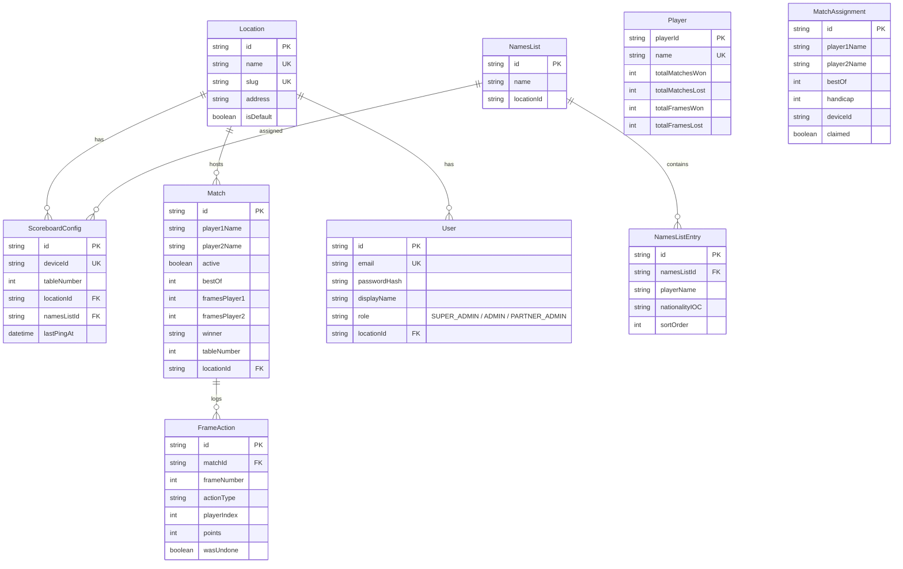

# RRSB Data Model

## ER Diagram



---

## Model Walkthrough

The schema has three logical groups: **original models** (pre-existing), **admin/device management** (new), and **standalone helpers** (new).

---

### Original Models (pre-existing)

These three models existed before the admin panel and remain fully backwards-compatible.

#### Player

Aggregate stats cache for the statistics-ui leaderboards. One row per unique player name. Fields like `totalMatchesWon` and `highBreaks` are denormalized summaries -- the source of truth is the `Match` + `FrameAction` tables.

#### Match

The central record for a snooker match. Stores both players inline by name (not FK), current frame scores, breaks arrays, and a `rawGameLog` JSON dump. The optional `locationId` FK was **added** in v0 -- see migration notes below.

#### FrameAction

An append-only event log for every action within a match: breaks, fouls, handicaps, frame ends, match ends, undos, and re-racks. Each row records which frame, which player, and how many points. The `wasUndone` flag marks actions that were later reverted. This is the audit trail that makes the `Player` stats rebuildable.

---

### Admin & Device Management (new)

These models power the admin panel, device registration, and RBAC.

#### Location

A physical venue/club. One location is marked `isDefault: true` (seeded as "Round Robin") -- new scoreboards auto-register here. The `slug` is used for URL-friendly identifiers.

**Relations:** A location owns many `ScoreboardConfig`s, `Match`es, and `User`s.

#### User

Admin panel users. Passwords are bcrypt-hashed. The `role` enum controls what a user can see and do:

| Role | Scope |
|------|-------|
| `SUPER_ADMIN` | Full access. Manage locations, users, all scoreboards. |
| `ADMIN` | Manage scoreboards, names lists, matches across all locations. |
| `PARTNER_ADMIN` | Scoped to their own `locationId` only. |

The optional `locationId` FK ties Partner Admins to their venue.

#### ScoreboardConfig

One row per physical scoreboard device. Created automatically the first time a scoreboard-ui pings the API (via `POST /api/scoreboards/ping`). The `deviceId` is a UUID generated in the browser's `localStorage`.

Key fields:
- `tableNumber` -- assigned by admin or set on-device via the password-protected settings dialog
- `namesListId` -- which player list the scoreboard's setup dialog should use
- `lastPingAt` -- updated every 30s; devices with `lastPingAt` < 5 minutes ago are shown as "online"

#### NamesList / NamesListEntry

A named collection of players that can be assigned to scoreboards. Replaces the bundled `spielerliste.csv` with a DB-managed list. Entries have `playerName`, `nationalityIOC`, and `sortOrder`. Entries cascade-delete when the parent list is removed. Can be populated manually or via CSV upload.

#### MatchAssignment

A lightweight "next match" instruction created by admins and consumed by scoreboards. When a scoreboard opens its setup dialog, it checks for unclaimed assignments matching its `deviceId`. If found, the player names and bestOf are pre-filled. The `claimed` flag is set to `true` when the match starts.

---

## Backwards Compatibility & Migration

### What changed on existing tables

Only **one column was added** to an existing table:

```
Match.locationId  String?  (nullable FK to Location)
```

This is a **non-breaking, additive change**:

- The column is nullable (`String?`), so all existing `Match` rows get `locationId = NULL` automatically -- no data backfill needed.
- All existing API endpoints (`/api/matches`, `/api/frame-actions`, `/players`, `/breaks`, `/matches/player`, `/highlights`) continue to work unchanged. They never read or write `locationId`.
- The `Player` and `FrameAction` tables are **completely untouched**.

### What the migration creates

Running `pnpm db:migrate` generates a single migration that:

1. Creates the `Role` enum type
2. Creates 6 new tables: `Location`, `User`, `ScoreboardConfig`, `NamesList`, `NamesListEntry`, `MatchAssignment`
3. Adds the nullable `locationId` column + FK constraint to the existing `Match` table

### Existing data

- **Matches**: All ~N existing matches remain as-is with `locationId = NULL`. They still appear in statistics-ui, live scores, break leaderboards, and player profiles.
- **Players**: Untouched. Stats continue to work.
- **FrameActions**: Untouched. Full audit trail preserved.

### Scoreboard-ui fallback

The scoreboard-ui changes are also backwards-compatible:
- If the API's ping endpoint is unreachable (e.g., old API version), the ping silently fails and the scoreboard works exactly as before.
- If no `namesListId` is configured, the setup dialog falls back to the bundled `spielerliste.csv`.
- The `deviceId` is generated on first load and stored in `localStorage` -- no user action required.

### Seed script

The seed (`pnpm seed:admin`) is idempotent (uses `upsert`). It creates:
- The default "Round Robin" location (if it doesn't exist)
- The initial Super Admin user (if the email doesn't exist; updates password if it does)
